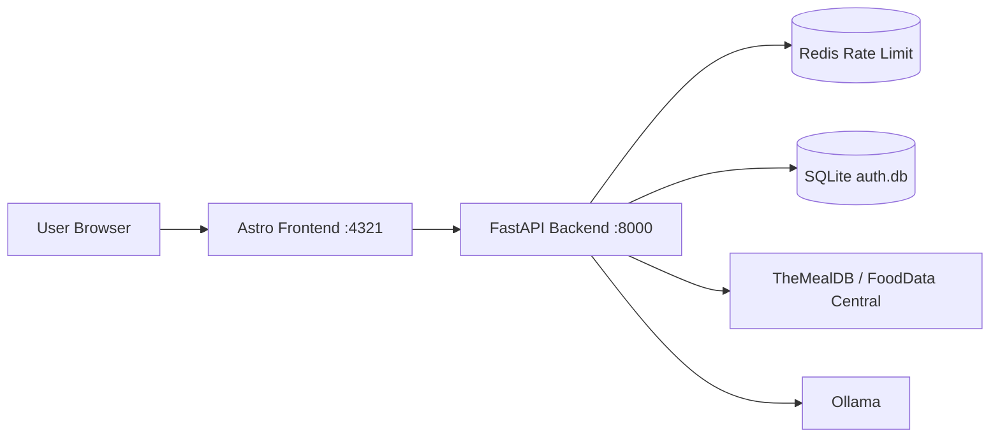

# RESTful API Proxy


A distributed-systems academic project that exposes a unified meal/recipe API through a FastAPI backend and an Astro frontend.

The backend proxies external services, applies rate limiting, and protects public `/v1/*` endpoints with API key authentication.

## Overview And Goals

Provide a simple interface to fetch:
- recipe suggestions
- food information
- full meal responses
- Aggregate and normalize responses from external APIs.
- Keep API key authentication lightweight and easy to operate for coursework.
- Run the full stack via Docker Compose for reproducible demos.

## Architecture Flow



## Tech Stack

- Backend: FastAPI, SQLModel, SlowAPI, uv
- Frontend: Astro
- Storage:
  - SQLite for API key users and credits
  - Redis for rate limiting
  - Containerization: Docker + Docker Compose

## Quick Start (Docker)

Run from repository root:

```bash
docker compose -f deployment/docker-compose.yaml up --build
```

App URLs:

- Frontend: `http://localhost:4321`
- Backend: `http://localhost:8000`
- API docs: `http://localhost:8000/docs`

Stop stack:

```bash
docker compose -f deployment/docker-compose.yaml down
```

## API Endpoints And Examples

Base URL:

- `http://localhost:8000`

Protected endpoints:

- `GET /v1/recipe`
- `GET /v1/food_info`
- `GET /v1/meal`

Use a key with header `x-api-key`:

```bash
curl -H "x-api-key: <YOUR_KEY>" "http://localhost:8000/v1/recipe?main_ingredient=cheese"
```

```bash
curl -H "x-api-key: <YOUR_KEY>" "http://localhost:8000/v1/food_info?food_name=banana"
```

```bash
curl -H "x-api-key: <YOUR_KEY>" "http://localhost:8000/v1/meal?main_ingredient=chicken"
```

API reference entry point:

- `http://localhost:8000/docs`

## Authentication (API Key)

> [!CAUTION]
> Never expose raw long-lived API keys in public client code or commits. Store keys in secure env variables and rotate if leaked.

Authentication model:

- Client sends `x-api-key` header.
- Backend hashes incoming key using HMAC + `API_KEY_PEPPER`.
- Hash is compared to `api_key_hash` in SQLite.
- If valid, request proceeds and credits are decremented.

Status behavior:

- `401` missing/invalid key
- `403` internal route without internal permissions
- `402` no credits left

Create a new key (from repo root):

```bash
cd backend
FOOD_DATA_CENTRAL_API_KEY=dummy THE_MEAL_DB_API_KEY=dummy uv run python -m auth.manage_keys create --name frontend-client
```

Initialize DB tables manually (if needed):

```bash
cd backend
FOOD_DATA_CENTRAL_API_KEY=dummy THE_MEAL_DB_API_KEY=dummy uv run python -m auth.manage_keys --init-db
```

## Database (SQLite) Usage

In Docker Compose, backend uses:

- `DATABASE_URL=sqlite:////data/auth.db`
- named volume `auth_db_data` mounted to `/data`

Inspect DB from terminal via Python (no `sqlite3` binary required):

```bash
docker compose -f deployment/docker-compose.yaml exec backend uv run python -c "import sqlite3; c=sqlite3.connect('/data/auth.db'); print(c.execute('select id,name,active,is_internal,curr_credits from api_users').fetchall()); c.close()"
```

Inspect DB from VS Code:

- Install extension `SQLite` by `alexcvzz`
- Open database file from container or local copy
- Run SQL queries in extension panel

## Local Development

Backend:

```bash
cd backend
uv sync
uv run uvicorn server:server --reload --port 8000
```

Frontend:

```bash
cd frontend
npm install
npm run dev
```

## Troubleshooting

`sqlalchemy.exc.OperationalError: no such table: api_users`

- Cause: DB tables were not initialized for the active `DATABASE_URL`.
- Fix:

```bash
cd backend
FOOD_DATA_CENTRAL_API_KEY=dummy THE_MEAL_DB_API_KEY=dummy uv run python -m auth.manage_keys --init-db
```

Then restart backend.

`401 Missing or invalid API key`

- Ensure request includes `x-api-key`.
- Ensure key was created with the same `API_KEY_PEPPER` value currently used by backend.

`Frontend works, API fails from browser`

- Check backend container health in compose.
- Confirm `PUBLIC_API_BASE_URL` points to backend service address expected by frontend runtime.
