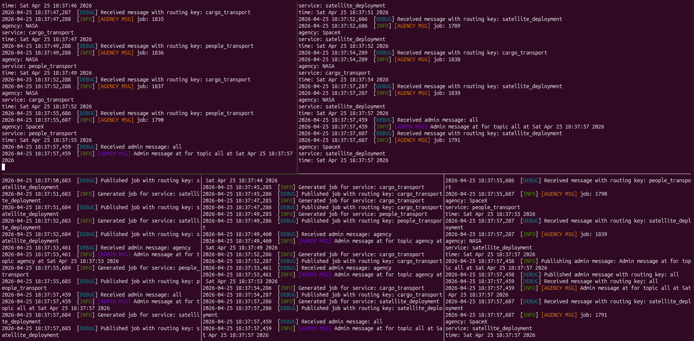
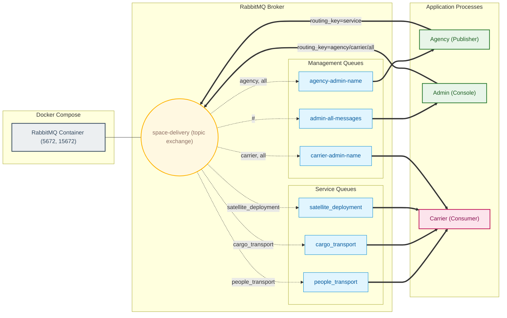
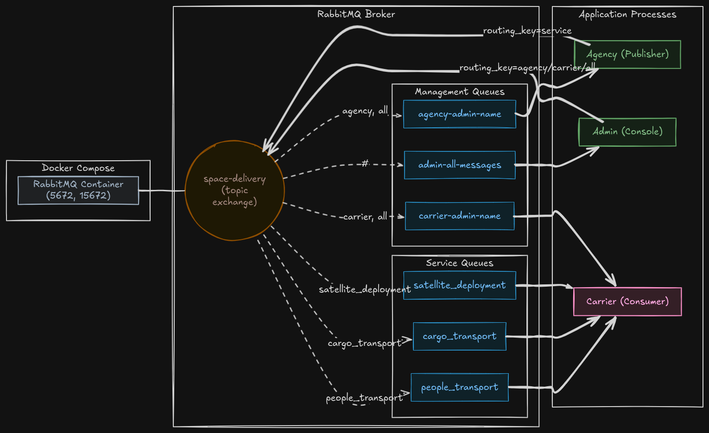
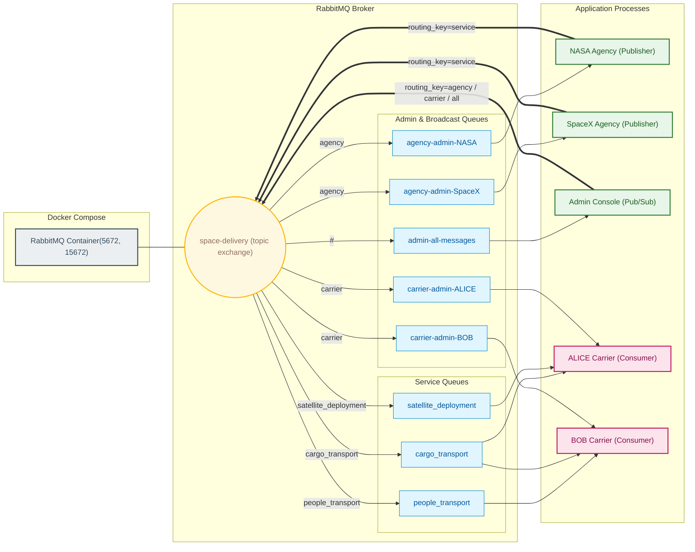
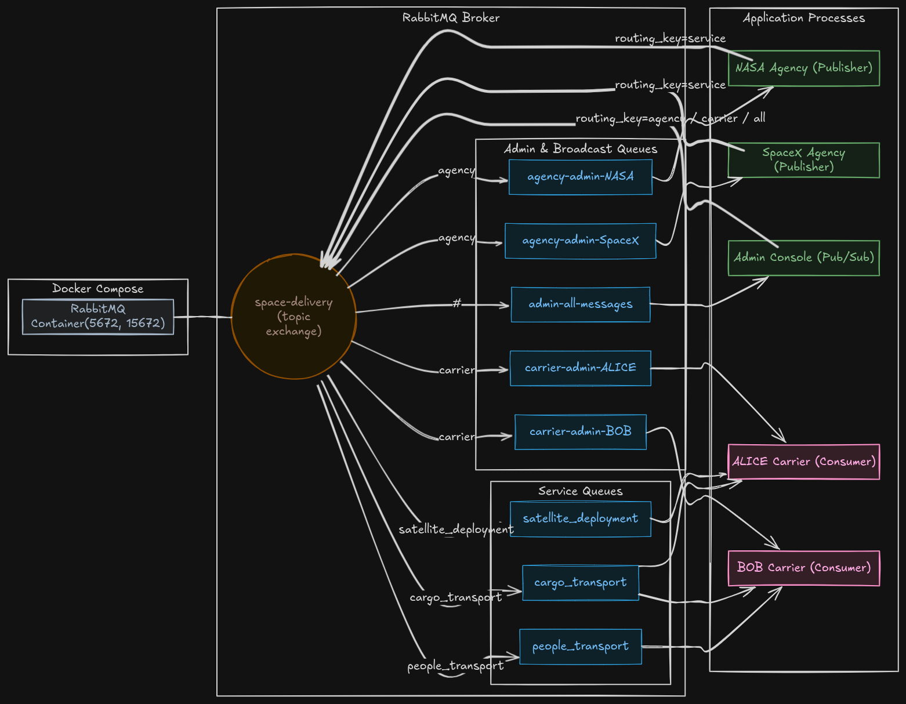

# Space Agency

## Description

This project simulates a space agency system using RabbitMQ for communication between different components. The system consists of carriers, agencies, and an admin that publishes messages to the carriers and agencies.

## Demo

Below is a demo of the system in action, showing the admin console, two carriers (ALICE and BOB) consuming messages from their respective queues, and two agencies (NASA and SpaceX) publishing jobs to the exchange.



## Architecture

Whole system architecture can be visualized as follows:



#### Excalidraw diagram architecture:



### How messages flow

- Agencies publish jobs to the `space-delivery` topic exchange using the service name as the routing key (e.g. `people_transport`, `cargo_transport`, `satellite_deployment`).
- The exchange routes messages to service-specific queues bound with the same routing key, and carriers consume from those queues.
- The Admin process publishes admin messages with routing keys `agency`, `carrier` or `all`. Per-node admin queues use names like `carrier-admin-messages-queue-<NAME>` and `agency-admin-messages-queue-<NAME>` and are bound to the exchange for `carrier`/`agency` and `all` messages.
- An `admin-all-messages-queue` is bound to `#` so the Admin console can listen to every message flowing through the exchange.

## Components

- **Admin**: publishes admin broadcasts and listens to the global admin queue. See `src/space_agency/admin/admin.py`.
- **Agency**: generates jobs and publishes them to the exchange (routing_key = service). See `src/space_agency/agency/agency.py`.
- **Carrier**: consumes service queues (its configured services) and a per-carrier admin queue. See `src/space_agency/carrier/carrier.py`.
- **Shared**: RabbitMQ helpers, settings and callbacks live under `src/space_agency/shared/`.

## Running the project

Start the broker via Docker Compose (uses `.env` for `RABBITMQ_DEFAULT_USER` / `RABBITMQ_DEFAULT_PASS`):

```bash
docker compose -f deploy/docker-compose.yaml --env-file .env up --abort-on-container-exit
```

Start a carrier (example):

```bash
uv run carrier --name BOB --first-service "people_transport" --second-service "cargo_transport"
```

Start another carrier:

```bash
uv run carrier --name ALICE --first-service "cargo_transport" --second-service "satellite_deployment"
```

Start agencies:

```bash
uv run agency --name SpaceX
uv run agency --name NASA
```

Start the admin console (it publishes and also listens to the global admin queue):

```bash
uv run admin
```

**Architecture for the above exaple can be visualized as follows:**



#### Excalidraw example architecture diagram:



## Notes

- Exchange name: `space-delivery` (see `src/space_agency/shared/config.py`).
- Service names (routing keys) are defined in `Services` enum: `people_transport`, `cargo_transport`, `satellite_deployment`.
- Queue names and some config variables are defined in `src/space_agency/shared/config.py`.

